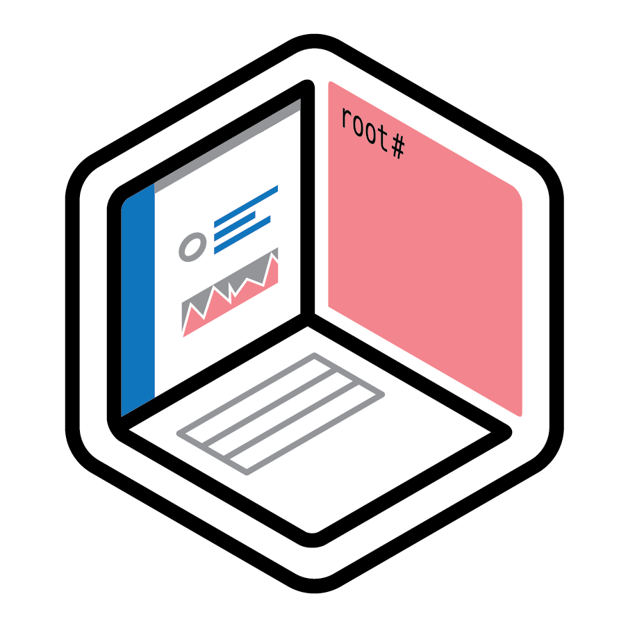

# Thremulation Station

 

 

<h2 align="center"><b>Threat emulation and detection for your laptop</b></h2>

   Collection of open source tools working together to enable a reasonably capable machine to serve as a local cyber range.

<b>
    <a href="https://thremulation.io">Thremulation.io</a> |
    <a href="https://github.com/thremulation-station/thremulation-station">Github</a> |
    <a href="https://twitter.com/thremulation">Twitter</a> |
    <a href="https://discord.gg/mtNXN4QjHh">Discord</a>
      
</b>

 
Thremulation Station is an approachable small-scale threat emulation and detection range. It leans on Atomic Red Team for emulating threats, and the Elastic Endpoint Agent for detection.

 
 

> **TL;DR** If you're ready to skip the reading and jump into things, head to the [Quickstart / Installation](/quickstart/installation.md) section.

## Project Goals

Our goal from the very beginning has been to provide the following:

1. Lightweight range that can operate on a laptop with a _minimum_ of 4 threads and 8G of RAM
1. Support the big 3 host operating systems (initial linux path is RHEL-based)
1. Present users a smooth path to execute threats and observe them with Elastic 
1. Provide a singular TUI (Station Control) that can be used to manage all aspects

## Getting Started

Ready to jump into things? Head over to the documentation at [docs.thremulation.io](https://docs.thremulation.io)!
